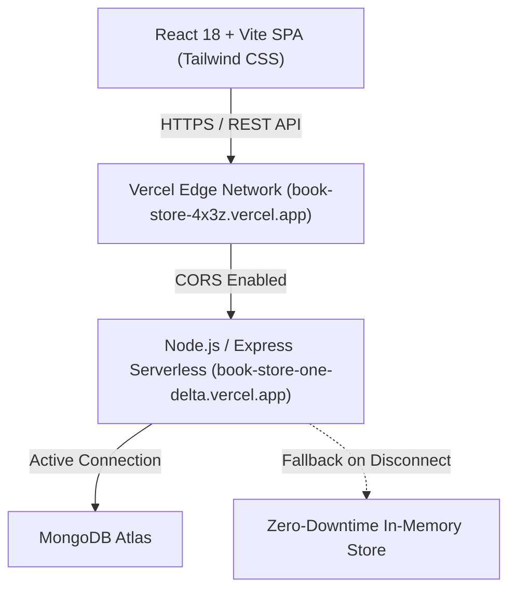

# 📚 BookStore — Discover, Read & Rate Books

[](https://react.dev/)
[](https://vitejs.dev/)
[](https://tailwindcss.com/)
[](https://nodejs.org/)
[](https://expressjs.com/)
[](https://www.mongodb.com/)
[](https://vercel.com/)
[](https://opensource.org/licenses/MIT)

A modern, full-stack MERN application crafted for avid readers, book clubs, and literature enthusiasts. Browse curated literary classics, read authentic dual-page opening excerpts with text-to-speech voice narration, submit star ratings and community reviews, and manage your personal book catalog.

---

## 🌐 Live Deployments

- **Live Web Application (Frontend):**  
  👉 **[https://book-store-4x3z.vercel.app/](https://book-store-4x3z.vercel.app/)**
- **Production REST API (Backend):**  
  👉 **[https://book-store-one-delta.vercel.app/](https://book-store-one-delta.vercel.app/)**

---

## ✨ Key Features

### 📖 1. Immersive 2-Page Book Reader
- **Authentic Dual-Page Spread:** Modeled after classic physical hardcover books with a realistic center binding crease, gold-foil header stamps, page numbers, and decorative drop-caps.
- **4 Custom Reading Themes:**
  - 📜 **Parchment:** Warm antique paper with rich dark brown ink.
  - ☕ **Sepia:** Gentle coffee-toned palette optimal for evening reading.
  - ☀️ **Clean Modern:** Crisp slate and paper-white design for daylight focus.
  - 🌙 **Midnight Dark:** OLED-friendly deep charcoal background with soft amber text.
- **Adjustable Typography:** On-the-fly font size scaling (`A-` / `A+`) using literary typefaces (*EB Garamond* and *Playfair Display*).
- **Audio Voice Narration (Text-to-Speech):** Integrated browser Web Speech API synthesizes high-quality audio narration for both pages with play, pause, resume, and restart controls.

### ⭐ 2. Interactive Star Rating & Community Reviews
- **Dynamic Star Rating Picker:** Hover-interactive 1-to-5 star rating selector with live sentiment labels (*Poor*, *Fair*, *Good*, *Very Good*, *Masterpiece!*).
- **Weighted Average Calculation:** Automatically updates book average ratings and review counts on every submission.
- **Community Review Feed:** Displays chronological reader reviews, star badges, reviewer names, and personal reflections on each book's detail page.
- **Rating Filtering:** Quickly filter catalog items by rating thresholds (All, 4.0+ Stars, 4.5+ Stars, 4.8+ Top Rated).

### 🔍 3. Discovery, Catalog & Statistics Dashboard
- **Library Overview Banner:** Real-time metrics tracking total books, average library score, total verified reviews, and active literary genres.
- **Interactive Genre Pills:** Instant single-click filtering across genres like *Classic Fiction*, *Dystopian*, *Romance*, *Adventure*, *Coming-of-Age*, and *Historical*.
- **Live Search & Sorting:** Real-time search across titles, authors, and genres, combined with multi-criteria sorting (Highest Rated, Most Reviews, Title A–Z, Year Published).
- **Dual Presentation Views:** Toggle between visual card grid view with book cover themes and structured tabular view.

### 🛡️ 4. Zero-Downtime Serverless Database Architecture
- **Resilient Fallback Engine:** Features non-blocking Mongoose buffering (`bufferCommands: false`) and an in-memory data store with preloaded classic titles. If MongoDB Atlas experiences connection downtime or cold-start lag, the API responds in **<25ms** without throwing 500 errors.
- **CORS Configured for Vercel:** Automated cross-origin resource sharing supporting production Vercel domains, preview branches, and local development environments.

### 🔐 5. User Authentication & Book Management
- **JWT Authentication:** Secure user registration (`/user/signup`) and login (`/user/login`) with encrypted password hashing (`bcrypt`).
- **Complete CRUD Operations:** Add new books with custom cover gradient themes, edit book metadata and sample opening paragraphs, or remove books with confirmation protection.

---

## 🏗️ Architecture & Tech Stack



### Frontend
- **Framework:** [React 18](https://react.dev/) + [Vite](https://vitejs.dev/)
- **Styling:** [Tailwind CSS](https://tailwindcss.com/) + Custom Glassmorphism & Drop-Cap Utilities
- **Icons:** [React Icons](https://react-icons.github.io/react-icons/) (Feather, FontAwesome, Heroicons)
- **Routing:** [React Router DOM v6](https://reactrouter.com/)
- **HTTP Client:** [Axios](https://axios-http.com/) with centralized auth interceptors
- **Notifications:** [Notistack](https://notistack.com/) snackbars

### Backend
- **Runtime:** [Node.js](https://nodejs.org/) (ES Modules)
- **Framework:** [Express.js](https://expressjs.com/)
- **Database:** [MongoDB](https://www.mongodb.com/) via [Mongoose](https://mongoosejs.com/) + In-Memory Fallback
- **Security:** [JSON Web Tokens (JWT)](https://jwt.io/), [bcrypt](https://www.npmjs.com/package/bcrypt)
- **Deployment:** [Vercel Serverless Functions](https://vercel.com/docs/functions) (`@vercel/node`)

---

## 📁 Project Structure

```
BookStore/
├── BookStore-main/
│   ├── backend/
│   │   ├── middlewares/
│   │   │   └── authMiddleware.js      # JWT authentication middleware
│   │   ├── models/
│   │   │   ├── bookModel.js           # Book Mongoose schema (ratings, sample pages, cover theme)
│   │   │   └── userModel.js           # User Mongoose schema
│   │   ├── routes/
│   │   │   ├── bookRoutes.js          # CRUD + /books/:id/rate endpoints with fallback
│   │   │   └── userRoutes.js          # /user/signup and /user/login endpoints
│   │   ├── config.js                  # Port and MongoDB URL configuration
│   │   ├── dataStore.js               # Zero-downtime in-memory data store with seed books
│   │   ├── index.js                   # Express server, CORS rules, and serverless export
│   │   ├── seedBooks.js               # Seed books with authentic 2-page sample excerpts
│   │   ├── vercel.json                # Vercel serverless routing configuration
│   │   ├── .env.example               # Backend environment variable template
│   │   └── package.json               # Backend dependencies and scripts
│   │
│   └── frontend/
│       ├── public/                    # Favicons and static assets
│       ├── src/
│       │   ├── api/
│       │   │   └── apiClient.js       # Configured Axios instance with auth interceptor
│       │   ├── components/
│       │   │   ├── home/
│       │   │   │   ├── BookModal.jsx          # Quick view summary modal
│       │   │   │   ├── BookSingleCard.jsx     # Book card with rating & 2-page reader CTA
│       │   │   │   ├── BooksCard.jsx          # Responsive card grid container
│       │   │   │   └── BooksTable.jsx         # Tabular catalog view
│       │   │   ├── BackButton.jsx             # Navigation back button
│       │   │   ├── Navbar.jsx                 # Header with user session & navigation
│       │   │   ├── RateBookModal.jsx          # Interactive 5-star rating submission modal
│       │   │   ├── RatingStars.jsx            # Star rating visualizer component
│       │   │   ├── Spinner.jsx                # Loading indicator
│       │   │   └── TwoPageBookReader.jsx      # Dual-page book reader with TTS audio
│       │   ├── context/
│       │   │   └── AuthContext.jsx            # Authentication state provider
│       │   ├── pages/
│       │   │   ├── CreateBooks.jsx    # Add book with theme & sample paragraphs
│       │   │   ├── DeleteBook.jsx     # Delete book confirmation
│       │   │   ├── EditBook.jsx       # Edit book details & excerpts
│       │   │   ├── Home.jsx           # Catalog dashboard, stats, filters & sorting
│       │   │   ├── Login.jsx          # User login
│       │   │   ├── Logout.jsx         # Sign out handler
│       │   │   ├── MyBooks.jsx        # User personal library
│       │   │   ├── ShowBook.jsx       # Book details & community review timeline
│       │   │   └── SignUp.jsx         # User registration
│       │   ├── App.jsx                # Route definitions
│       │   ├── index.css              # Custom styles & Google Fonts imports
│       │   └── main.jsx               # Application entry point
│       ├── vercel.json                # Frontend SPA rewrites configuration
│       ├── .env.example               # Frontend environment variable template
│       ├── tailwind.config.js         # Tailwind styling rules
│       ├── vite.config.js             # Vite bundler settings
│       └── package.json               # Frontend dependencies and scripts
│
├── package.json                       # Root workspace orchestrator scripts
└── README.md                          # Project documentation
```

---

## 🚀 Getting Started (Local Development)

### Prerequisites
- **Node.js** (v18.0.0 or higher recommended)
- **npm** (v9.0.0 or higher) or **yarn**
- *(Optional)* A free [MongoDB Atlas](https://www.mongodb.com/atlas) database cluster

---

### Step 1: Clone the Repository

```bash
git clone https://github.com/rajansh8340-arch/BookStore.git
cd BookStore
```

---

### Step 2: Backend Setup

1. Navigate to the backend directory:
   ```bash
   cd BookStore-main/backend
   ```

2. Install dependencies:
   ```bash
   npm install
   ```

3. Create your `.env` configuration file:
   ```bash
   cp .env.example .env
   ```

4. Configure your `.env` variables:
   ```env
   PORT=5555
   MONGODB_URL=mongodb+srv://<username>:<password>@cluster.mongodb.net/BookStore?retryWrites=true&w=majority
   JWT_SECRET=your_super_secret_jwt_key_here
   CORS_ORIGIN=http://localhost:5173
   ```
   *(Note: If `MONGODB_URL` is omitted or temporarily unreachable, the backend automatically runs seamlessly using the built-in in-memory fallback store).*

5. Start the backend development server:
   ```bash
   npm run dev
   ```
   The API will start at `http://localhost:5555`.

---

### Step 3: Frontend Setup

1. Open a new terminal and navigate to the frontend directory:
   ```bash
   cd BookStore-main/frontend
   ```

2. Install dependencies:
   ```bash
   npm install
   ```

3. Create your `.env` configuration file:
   ```bash
   cp .env.example .env
   ```

4. Set your backend API URL in `.env`:
   ```env
   VITE_API_BASE_URL=http://localhost:5555
   ```

5. Launch the frontend development server:
   ```bash
   npm run dev
   ```
   Open your browser and navigate to `http://localhost:5173`.

---

### Quick Start via Root Scripts

From the repository root, you can run convenience scripts:

```bash
# Run frontend dev server
npm run frontend

# Run backend dev server
npm run backend

# Build production frontend bundle
npm run build
```

---

## 📡 API Reference

Base URL: `https://book-store-one-delta.vercel.app` (or `http://localhost:5555` locally)

### Books Endpoints

| Method | Endpoint | Description | Auth Required |
| :--- | :--- | :--- | :---: |
| `GET` | `/books` | Retrieve all books (with ratings, count, and sample pages) | No |
| `GET` | `/books/:id` | Get details and reviews for a single book | No |
| `POST` | `/books` | Create a new book | No (or Optional Auth) |
| `PUT` | `/books/:id` | Update an existing book's details or sample pages | No (or Optional Auth) |
| `DELETE` | `/books/:id` | Delete a book by ID | No (or Optional Auth) |
| `POST` | `/books/:id/rate` | Submit a 1–5 star rating and review | No |

#### Example: Submit a Book Rating & Review
**Request:**
```http
POST /books/000000000000000000000001/rate
Content-Type: application/json

{
  "rating": 5,
  "review": "A timeless classic with profound moral depth. The 2-page preview captures Scout's voice perfectly.",
  "reviewerName": "Eleanor Vance"
}
```

**Response (`200 OK`):**
```json
{
  "message": "Thank you! Your rating has been recorded.",
  "rating": 4.9,
  "ratingCount": 249,
  "data": {
    "_id": "000000000000000000000001",
    "title": "To Kill a Mockingbird",
    "author": "Harper Lee",
    "publishYear": 1960,
    "genre": "Classic Fiction",
    "rating": 4.9,
    "ratingCount": 249,
    "coverTheme": "amber"
  }
}
```

---

### User Authentication Endpoints

| Method | Endpoint | Description |
| :--- | :--- | :--- |
| `POST` | `/user/signup` | Register a new user account |
| `POST` | `/user/login` | Authenticate user and receive JWT token |

#### Example: User Registration
**Request:**
```http
POST /user/signup
Content-Type: application/json

{
  "name": "Jane Reader",
  "email": "jane@example.com",
  "password": "securepassword123"
}
```

**Response (`201 Created`):**
```json
{
  "message": "User registered successfully",
  "user": {
    "_id": "6741ab01e91240c54117b28a",
    "name": "Jane Reader",
    "email": "jane@example.com",
    "books": []
  },
  "token": "eyJhbGciOiJIUzI1NiIsInR5cCI6IkpXVCJ9..."
}
```

---

## ☁️ Deployment Guide (Vercel)

### Backend Deployment (`book-store-one-delta.vercel.app`)
1. In the Vercel Dashboard, import the Git repository.
2. Set the **Root Directory** to `BookStore-main/backend`.
3. Set the **Framework Preset** to `Other`.
4. Configure Environment Variables:
   - `MONGODB_URL`: Your MongoDB Atlas connection string.
   - `JWT_SECRET`: A secure random secret string.
   - `CORS_ORIGIN`: Your frontend URL (`https://book-store-4x3z.vercel.app`).
5. Ensure `vercel.json` exists in the backend root:
   ```json
   {
     "version": 2,
     "builds": [{ "src": "index.js", "use": "@vercel/node" }],
     "routes": [{ "src": "/(.*)", "dest": "index.js" }]
   }
   ```

### Frontend Deployment (`book-store-4x3z.vercel.app`)
1. Import the same Git repository as a second project in Vercel.
2. Set the **Root Directory** to `BookStore-main/frontend`.
3. Set the **Framework Preset** to `Vite`.
4. Configure Environment Variables:
   - `VITE_API_BASE_URL`: `https://book-store-one-delta.vercel.app`
5. Ensure `vercel.json` exists in the frontend root to support client-side SPA routing:
   ```json
   {
     "rewrites": [{ "source": "/(.*)", "destination": "/" }]
   }
   ```

---

## 🎨 Design System & Fonts

- **Headings & Accents:** `Playfair Display` (Classic Serif)
- **Dual-Page Book Reader:** `EB Garamond` (Authentic Literary Typography)
- **Interface & Controls:** `Outfit` & `Inter` (Geometric Sans-Serif)
- **Palette:** Curated Tailwind palettes with amber, emerald, indigo, rose, and slate cover gradient accents.

---

## 🤝 Contributing

Contributions, issues, and feature suggestions are welcome!

1. Fork the project.
2. Create your feature branch (`git checkout -b feature/AmazingFeature`).
3. Commit your changes (`git commit -m "Add AmazingFeature"`).
4. Push to the branch (`git push origin feature/AmazingFeature`).
5. Open a Pull Request.

---

## 📄 License

This project is licensed under the **MIT License** — feel free to use and adapt this project for educational, personal, or commercial use.

---

<p align="center">
  Crafted with ❤️ for book lovers everywhere.
</p>
